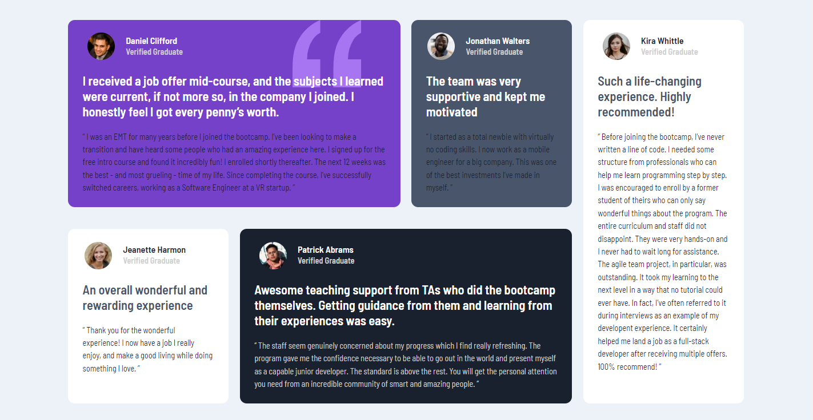

# Testimonials-Grid-Section

This is a solution to the [Testimonials grid section challenge on Frontend Mentor](https://www.frontendmentor.io/challenges/testimonials-grid-section-Nnw6J7Un7). Frontend Mentor challenges help you improve your coding skills by building realistic projects. 

## Table of contents

- [Overview](#overview)
  - [The challenge](#the-challenge)
  - [Screenshot](#screenshot)
  - [Links](#links)
- [My process](#my-process)
  - [Built with](#built-with)
  - [What I learned](#what-i-learned)
  - [Continued development](#continued-development)
  - [Useful resources](#useful-resources)
- [Author](#author)

## Overview

### The challenge

Users should be able to:

- View the optimal layout for the site depending on their device's screen size

### Screenshot



### Links

- Solution URL: [Add solution URL here](https://github.com/samiuzaman/Testimonials-Grid-Section).
- Live Site URL: [Add live site URL here](https://samiuzaman.github.io/Testimonials-Grid-Section).

### Built with

- Semantic HTML5 markup
- CSS custom properties
- Flexbox
- CSS Grid
- Mobile-first workflow

### What I learned

I will learn CSS Grid Layout.

```css
body {
  background-color: var(--lightgrayishblue);
  font-size: 13px;
  font-family: "Barlow Semi Condensed", sans-serif;
}
section {
    display: grid;
    grid-template-columns: repeat(4, 1fr);
    grid-template-rows: repeat(2, min-content);
    gap: 24px;
  }
```

If you want more help with writing markdown, we'd recommend checking out [The Markdown Guide](https://www.markdownguide.org/) to learn more.

### Useful resources

- ([Frontend Mentor](https://www.frontendmentor.io/))
- ([W3Schools](https://www.w3schools.com/))

## Author

- Frontend Mentor - [@samiuzaman](https://www.frontendmentor.io/profile/samiuzaman)
- Twitter - [@samiuzzaman201](https://www.twitter.com/samiuzzaman201)
- LinkedIn - [@samiuzaman/](https://www.linkedin.com/in/samiuzaman)
